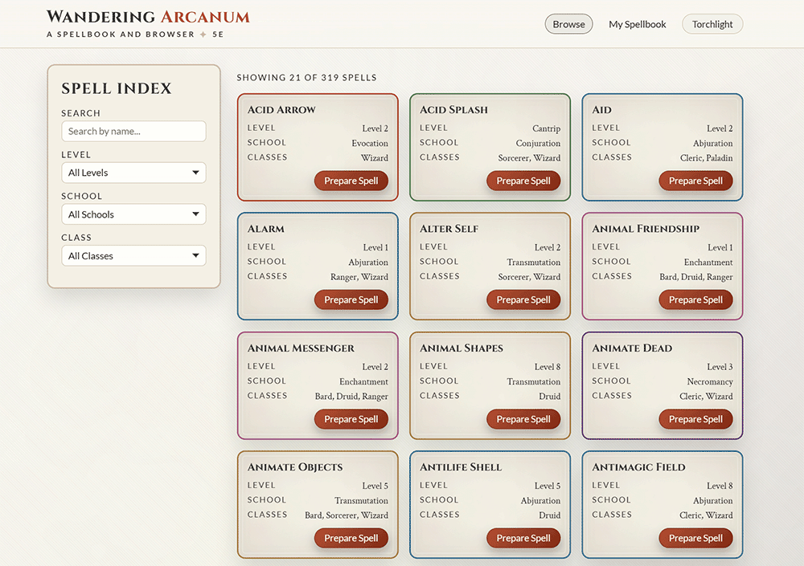

# Wandering Arcanum ◆ A 5E Spellbook & Browser


> **[🚀 View the Live Application](https://wandering-arcanum.vercel.app)**
>
> _A high-performance, PWA-enabled 5e spell management tool built with React 18._

<p align="center">
  
</p>

## 📜 Project Description

Wandering Arcanum is a highly optimized, React-based 5th Edition spell browser and management tool. Designed for players and Dungeon Masters alike, this application allows users to effortlessly explore, filter, and 'prepare' spells, creating a personalized digital spellbook that persists across sessions.

Built with a focus on exceptional performance and user experience, it features a unique "Arcane Grimoire" design system. The UI embraces a "paper and ink" aesthetic with thematic typography, flawless geometric card borders, and color-coded spell classifications, ensuring an immersive and highly accessible interface.

<p align="center">
  
</p>

## ⚙️ Key Features & Architecture

<details>
  <summary><b>🛠 View Technical Architecture & Key Features</b></summary>

### ⚡ Performance & Data Fetching

- **Parallel API Resolution:** Uses a custom Intersection Strategy (`Promise.all`) to fetch and cross-reference multiple 5e API endpoints simultaneously, preventing massive data downloads and keeping the DOM lean.
- **Debounced Search:** Implements a 400ms debounce on the search input to protect the API from rate limits (`429 Too Many Requests`) during rapid user typing.
- **Optimized Rendering:** Maintains a perfect 0ms Total Blocking Time (TBT) and 0 Cumulative Layout Shift (CLS) by utilizing early resource preconnecting and hardware-accelerated CSS transforms.
- **Memoized Component Architecture:** Utilizes React.memo and useCallback to prevent unnecessary re-renders in the SpellCard list, ensuring that 300+ spells can be managed with zero frame-drops.
- **Clean Architecture**: Centralized global state management (Theme, Routing, and Spellbook) within a dedicated Providers abstraction to keep the entry point lean and maintainable.

### 📖 Comprehensive Spell Browser

- **Dynamic Filtering:** Filter spells by Level (Cantrip–9th), School (Evocation, Necromancy, etc.), and Class.
- **Pagination & Memory:** Uses an infinite-scroll style "Load More" system built on a symmetrical 21-card grid (7x3), combined with `useRef` to perfectly maintain scroll position when the DOM updates.
- **Detailed Spell Views:** Click on any spell card to access a dedicated page with in-depth information, including casting time, range, components, duration, and full descriptions.

### 🔮 Personalized Spellbook

- **Global State Management:** "Prepare Spell" functionality allows users to add spells to a global spellbook.
- **Data Persistence:** Spells persist entirely across browser sessions using `localStorage`.
- **Dedicated Management:** A "My Spellbook" view allows users to easily review and remove prepared spells.

### 🎨 Immersive Design System ("Arcane Grimoire")

- **WCAG 2.1 AA Compliance:** Full keyboard navigation, ARIA labels, semantic HTML, and dynamic focus states.
- **Semantic Data Integrity:** Leverages advanced HTML5 landmarks and Description Lists (<dl>) for spell metadata, providing a superior experience for assistive technologies compared to standard div-based layouts.
- **Three Theme Modes:** Light (Parchment), Dark (Deep Umber), and "Darkvision" (High-Contrast Grayscale) with seamless CSS variable toggling.
- **Design Token System:** Built on a centralized CSS Variable architecture, allowing for instant global theme shifts and easy scaling of the design system.
- **Mathematical CSS Geometry:** Spell cards utilize precise `calc()` functions to ensure inner and outer border radii remain perfectly parallel regardless of dynamic sizing or prepared state changes.

</details>

## 👁️ The Developer's Perspective

<details>
  <summary><b>🔮 Deep Dive: Solving Architectural Challenges</b></summary>

### 1. Overcoming API Limitations (The Intersection Strategy)

One significant hurdle was a limitation in the 5e API: the primary `/api/spells` endpoint does not support a `class` filter, while the `/api/classes/{class}/spells` endpoint does not support `level` or `school` filters.

To provide a seamless, multi-category filtering experience without downloading the entire 300+ spell database (which would tank performance), I implemented an **Intersection Strategy**:

- **Parallel Requests:** Using `Promise.all`, the app simultaneously fetches the filtered list from the base endpoint and the full list from the class endpoint.
- **Data Cross-Referencing:** I utilized a JavaScript `Set` to perform a high-speed intersection of the two lists, ensuring only spells present in both datasets are rendered. This kept the initial payload small and the UI lightning-fast.

### 2. Protecting the Weave (Debouncing)

To prevent the app from triggering dozens of unnecessary API calls during rapid typing (which led to `429 Too Many Requests` errors), I implemented a **custom debounce timer**. By delaying the fetch by 400ms, I ensured that only a single, intentional request is sent once the user stops typing, significantly reducing server load and improving the "snappiness" of the search results.

### 3. Mathematical Layout Integrity

Achieving the "Arcane Grimoire" aesthetic required a complex double-border system. Standard CSS borders often "pinch" at the corners when nested. I solved this by using `calc()` functions to dynamically adjust the `border-radius` of the inner elements based on the outer radius and the specific inset distance, maintaining perfect geometric parallelism across all 21 cards in the grid.

</details>

## 📦 Modern Tech Stack

- ⚛️ **React 18:** Functional components utilizing Hooks (`useState`, `useEffect`, `useMemo`, `useRef`) and custom hooks for global state.
- ⚡ **Vite:** Next-generation frontend tooling for highly optimized production builds.
- 📲 **Progressive Web App (PWA):** Custom Service Worker implementation for offline caching and instant loading.
- 🛣️ **React Router v6:** Declarative client-side routing.
- 🐉 **5e API:** Dynamic data fetching from the [5e-SRD](https://www.dnd5eapi.co/).
- 🎨 **CSS3:** Custom properties (variables), Grid, Flexbox, and complex `calc()` geometry for a responsive, heavily themed UI.

## 🗝️ Installation & Setup

### Using GitHub Codespaces

1. Click the **Code** button on this repository.
2. Select the **Codespaces** tab.
3. Click **Create codespace on main**.
4. Once the environment loads, run:
   ```bash
   npm install
   npm run dev
   ```

### Local Setup

1. Clone the Repository:
   ```bash
   git clone https://github.com/BenGephardt/wandering-arcanum.git
   cd wandering-arcanum
   ```
2. Install Dependencies:
   ```bash
   npm install
   ```
3. Start Development Server:
   ```bash
   npm run dev
   ```
4. Build & Preview for Production (To view Lighthouse/PWA optimizations):
   ```bash
   npm run build
   npm run preview
   ```

## 🖋️ Acknowledgements

- Data provided by the fantastic [D&D 5e API](https://www.dnd5eapi.co/).
- Built with guidance and the core engineering foundations developed through [Launch School](https://launchschool.com) and [Codecademy](https://www.codecademy.com).
- Fonts provided by [Google Fonts](https://fonts.google.com/) (Cinzel, Crimson Text, Lato).

## ⚖️ Legal Attribution

This work includes material taken from the System Reference Document 5.1 (“SRD 5.1”) by Wizards of the Coast LLC and available at [https://dnd.wizards.com/resources/systems-reference-document](https://dnd.wizards.com/resources/systems-reference-document). The SRD 5.1 is licensed under the Creative Commons Attribution 4.0 International License available at [https://creativecommons.org/licenses/by/4.0/legalcode](https://creativecommons.org/licenses/by/4.0/legalcode).

## 📄 License

This project is distributed under the **GNU General Public License v3.0 (GPLv3)**. See `LICENSE` for more information.

---

📬 **Contact:** BenGephardt - [https://github.com/BenGephardt](https://github.com/BenGephardt)
